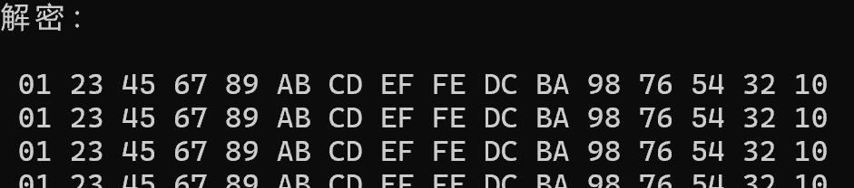

## Project 1: SM4软件实现与优化
#### 项目分工
| 姓名 | 分工                     |
|-------|--------------------------|
|  童皓琛   | SM4软件实现与AESNI优化实现         |
|  崔倡通  | 多线程优化实现与报告编写 |

### 实验目标
实现SM4分组密码算法并进行多级优化

### 实验内容
#### a) SM4的实现
分别完成SM4的轮密钥生成，加密以及解密操作
1：**轮密钥生成**
由函数SM4_Key_set()实现。首先获得初始密钥key，将其使用大端序存入数组k，然后将其作为sm4加密的输入，经过S盒以及L变换，运行32轮后得到轮密钥，并储存在round_keys中

2：**sm4加密**
由函数SM4_encrypt()实现。首先将输入的密文换为大端序存入x中，然后对其进行32轮加密操作，每轮经过下面操作：X1，X2，X3先与轮密钥异或，将得到的值拆成四部分，过S盒后再整合之后，然后经过线性变换L，再与X0异或后得到心一轮的X3，将上一轮的X1，X2，X3作为下一轮的X0，X1，X2。如下图所示：

代码如下：

完成轮函数后，将最后一轮的结果反序输出，然后换为大端序返回结果到enc_result中

3：**sm4解密**
解密函数由SM4_decrypt()。解密函数与加密函数结构完全相同，唯一的区别是轮密钥使用时需逆序输入。

4：**sm4加解密测试**
轮密钥生成测试：

加解密测试，对64组消息进行加解密：

测试结果如下
要加密的消息：

轮密钥：

加解密结果：

#### b) SM4的优化
基本思想是利用SIMD指令集做并行化处理，并且根据SM4与AES中S盒结构的相似性，借助intel的AESNI指令完成S盒操作，核心是采用AESNI指令集中的_mm_aesenclast_si128指令，执行如下操作：

首先通过映射将SM4的S盒所在的有限域中的元素，转换到AES的S盒所使用的域中，然后使用_mm_aesenclast_si128进行查表，再通过映射将其换回SM4的S盒所在的域中。此操作能有效减小SM4加密中S盒查表所需开销。

其中还执行了矩阵乘法的优化，将矩阵与向量的乘法拆分为两个查表，在后文会结合代码讲述。由于轮密钥可以提前生成，并且主要占用在存取方面，因此没有去做优化。

1：**SIMD指令集的使用**
使用了AVX指令集，其寄存器长度为256位。首先将密文存入4个寄存器，整合后换为大端序。此处的操作通过以下例子来说明：假如输入的密文是1234 1234 1234 1234，tmp载入后结果不变，打包进x数组后的结果为1111 2222 3333 4444，最后再换为大端序。打包进x数组的操作相当于做了一次对齐，将需要加密的每四组密文的第1，2，3，4位，分别存入x数组的1，2，3，4的位置。之后对x数组执行加密相当于对四组数据并行加密。当然由于这里使用了256长度的寄存器，实际上是对8组数据同时进行处理。

加密过程中的异或操作：

逆序输出：

2：**AESNI优化**
第二个优化的部分便是SM4的S盒查找。通过网上的资料，查找到域变换的流程

以及所需的矩阵(可以预计算得出)

先编写矩阵乘法的优化，将矩阵与向量的乘法拆解为两个查表操作，向量的高四位查找higherMask表，低四位查找lowerMask表，查找表可以预计算得出。乘法代码如下：

矩阵$A_{s}T^{-1}A_{a}^{-1}$对应的查找表

矩阵$TA_{s}$对应的查找表

因此，S盒的查找被优化为以下流程：
（1）：乘矩阵$TA_{s}$
（2）：加上向量$TC_{s}$
（3）：过AES的S盒，由于此处使用了256位的寄存器，因此需要先将其分成两部分，分别使用_mm_aesenclast_si128指令，之后再整合
（4）：乘矩阵$A_{s}T^{-1}A_{a}^{-1}$
（5）：加上向量$A_{s}T^{-1}A_{a}^{-1}C_{a}+C_{s}$
代码如下：

由于_mm_aesenclast_si128指令相当于执行AES最后一轮操作，即过S盒，行移位，异或轮密钥（此处轮密钥设置为0因此无作用），所以要加入一次逆行移位的过程，放在了代码开头。
3：**多线程优化**
（1）并行任务划分
- 采用数据级并行策略
- 将N组明文均匀分配到CPU各核心
- 每组线程处理N/thread_num个加密任务

（2）实现说明
- 基于C++11标准线程库
- 硬件并发数自动检测（hardware_concurrency）
- 线程池模式管理加密任务
