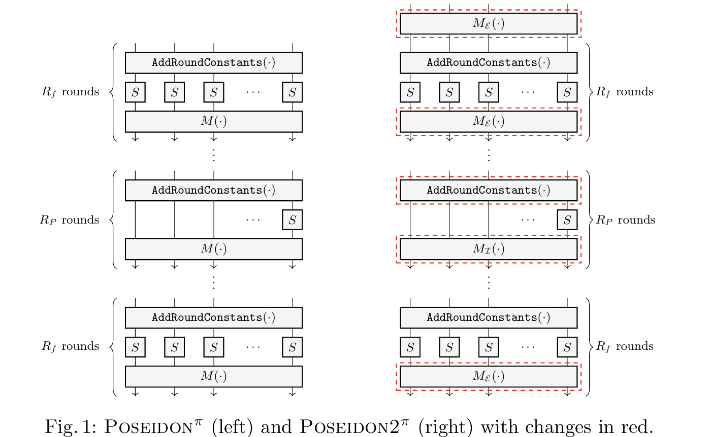
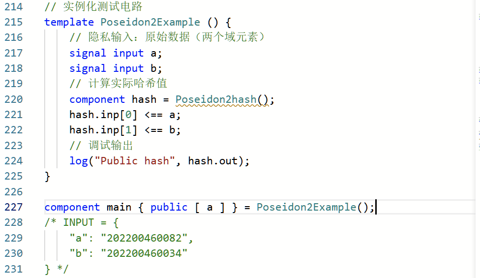
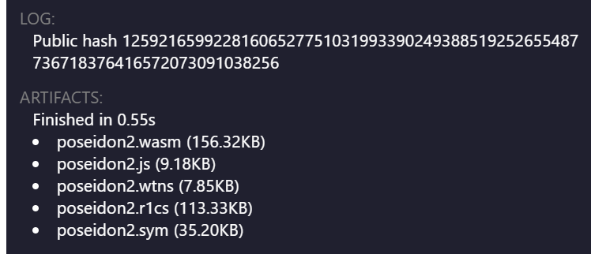
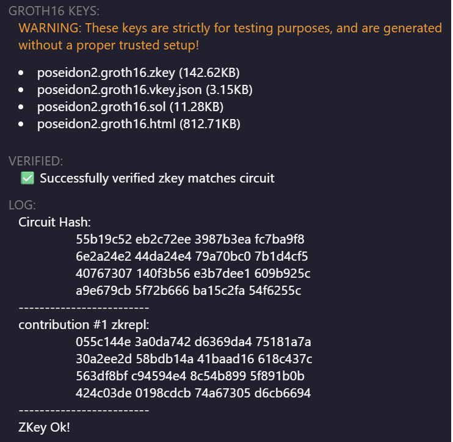

## Project 3: Circom实现Poseidon2哈希电路
#### 项目分工
| 姓名 | 分工                     |
|-------|--------------------------|
|  崔倡通  | 哈希电路代码及相关报告说明编写 |
|  童皓琛   | 实例化测试、生成证明及相关报告编写       |

### 实验目标
使用Circom语言实现Poseidon2哈希算法的零知识证明电路

### 实验内容
#### 1. **Poseidon2哈希算法原理概述**
##### (1).基本概念:Poseidon2是一种专为零知识证明设计的哈希算法。
##### (2).参数配置
本次实验中采用的Poseidon2的算法参数`(n,t,d)=(256,3,5)`
- **有限域大小**：$p$为255位素数，$n=\lceil\log_2(p) \rceil=256$，满足$\gcd(d,p − 1) = 1 $的最小$d=5$。
- **状态大小**：$t=3$。
- **轮数**：Full Rounds $R_f= 8$,Partial Rounds $R_P=56$。
##### (3).具体步骤
① 初始化：将输入原像的(t − 1)个元素通过拼接和填充的方式转换成包含t个有限域元素的中间状态state，输入$M_{\epsilon}$线性层进行运算;
➁ 进行$R_f$次Full Round循环：每次循环中需要对state向量的所有元素依次完成异或轮常数AddRoundConstants(·)、过S-盒S-Box和过线性层$M_{\epsilon}$进行 MDS Mixing操作，其中Add Round Constants需要完成一次常数加法，S-Box需要计算五次模幂，MDS Mixng计算的是state向量和常数矩阵M相乘;
➂ 进行$R_P$ 次Partial Round循环：每次循环中需要对state向量的所有元素依次完成异或轮常数AddRoundConstants(·)、第一个元素过S-盒S-Box和过线性层$M_{\mathcal{I}}$ 进行MDS Mixing操作；
➃ 进行$R_f$次Full Round循环：计算流程与步骤➁一致；
➄ 输出：在完成步骤1-4中总共$2R_f + R_P$次循环后，将state向量中的第二个元素作为哈希运算的结果输出；

#### 2. **Poseidon2代码实现**
##### (1). Poseidon2函数核心组件
` S-Box电路模板 template SBox() `
实现Poseidon哈希算法中的**非线性变换层**，完成域元素$x$到$x^5$的映射
$ \text{SBox}(x) = x^5 $

` Poseidon2 ExternalRound 电路 template ExternalRound(i) `
实现Poseidon2的**完整轮次**(Full Round)计算，包含：
- 全状态轮常数加法
- 全状态S-box非线性变换
- 线性扩散层(MDS)

` Poseidon2 InternalRound 电路 template InternalRound(i) `
实现Poseidon2的**部分轮次**(Partial Round)计算，包含：
- 轮常数加法
- S-box非线性变换
- 线性混合层(MDS)
  
` Poseidon2 线性层电路 template LinearLayer() `
实现3×3 MDS矩阵线性变换。
` Poseidon2 置换函数 template Permutation() `
按照所给上述算法原理与算法参数组合函数组件，实现Poseidon2 置换函数。
` Poseidon2 哈希函数 template Poseidon2hash() `
实现2输入→1输出的域元素压缩。

##### (2). Poseidon2函数实例化测试

#### 3. **Poseidon2 Groth16算法生成证明**
编译中间文件

生成可信设置文件

