## Project 4: SM3的软件实现与优化 
#### 项目分工
| 姓名 | 分工                     |
|-------|--------------------------|
|  童皓琛   | SM3软件实现优化与length-extension attack验证 报告编写    |
|  崔倡通  | SM3构建Merkle树及相关存在性证明 报告整合 |

### 实验目标
1：实现SM3分组密码算法并进行多级优化
2：使用SM3验证长度拓展攻击
3：使用SM3根据RFC6962构建Merkle树，并构建叶子的存在性证明与不存在性证明

### 实验内容
#### a) SM3的实现及优化
##### 1：**SM3的实现**
- 首先创建结构体ctx，state数组用于SM3哈希流程，buf存储需要哈希的消息，buf_len与compress_len分别是消息长度，以及已经压缩的数据的长度
```C++
struct sm3_ctx
{
	uint32_t state[8];
        unsigned char buf[64] = {0};
	unsigned int buf_len;
	uint64_t compressed_len;
};
const uint32_t T_0 = 0x79cc4519, T_1 = 0x7a879d8a;
```
- 然后实现SM3的数据分块填充过程
函数SM3_input用于将数据分块，分出一个块时对其进行哈希，将哈希结果作为下一轮的iv
```C++
void sm3_input(sm3_ctx* ctx, const unsigned char* input, unsigned int length) {
	//将输入数据添加到缓冲区
	for (unsigned int i = 0; i < length; i++) {
		ctx->buf[ctx->buf_len] = input[i];
		ctx->buf_len++;
		if (ctx->buf_len == 64) { //如果缓冲区满了，则进行压缩
			sm3_compress(ctx);
			ctx->compressed_len += 512; 
			ctx->buf_len = 0;
		}
	}
}
```
初始的iv由SM3_init生成，是固定8个常量
```c++
//初始化常量
void sm3_init(sm3_ctx* ctx) {
	ctx->state[0] = 0x7380166f;
	ctx->state[1] = 0x4914b2b9;
	ctx->state[2] = 0x172442d7;
	ctx->state[3] = 0xda8a0600;
	ctx->state[4] = 0xa96f30bc;
	ctx->state[5] = 0x163138aa;
	ctx->state[6] = 0xe38dee4d;
	ctx->state[7] = 0xb0fb0e4e;
	ctx->buf_len = 0;
	ctx->compressed_len = 0;
}
```
- 然后是数据填充，当分完块之后，对最后一个块进行填充。首先在最后一个块的尾端加上80，然后填充0直到块大小为56*8bit，最后加上消息的长度信息。然后将最后一个块压缩，将结果传入输出output
```c++
//初始化常量
void sm3_do(sm3_ctx* ctx, unsigned char* output) {
	//填充数据
	unsigned int i = ctx->buf_len;
	unsigned char msglen[8];
	uint64_t  total_len, high, low;

	ctx->buf[i++] = 0x80; //添加一个1位
	if (i > 56) { //如果填充后超过56字节，则需要先压缩一次
		while (i < 64) {
			ctx->buf[i++] = 0x00;
		}
		sm3_compress(ctx);
		i = 0;
	}
	while (i < 56) { //填充到56字节
		ctx->buf[i++] = 0x00;
	}
	//添加长度信息
	total_len = ctx->compressed_len + (ctx->buf_len * 8);
	high = (total_len >> 32) & 0x0FFFFFFFF;
	low = (total_len) & 0x0FFFFFFFF;

	GM_PUT_UINT32_BE(high, msglen, 0);
	GM_PUT_UINT32_BE(low, msglen, 4);
	for (int i = 0; i < 8; i++) {
		ctx->buf[56 + i] = msglen[i];
	}
	sm3_pro_compress(ctx);

	GM_PUT_UINT32_BE(ctx->state[0], output, 0);
	GM_PUT_UINT32_BE(ctx->state[1], output, 4);
	GM_PUT_UINT32_BE(ctx->state[2], output, 8);
	GM_PUT_UINT32_BE(ctx->state[3], output, 12);
	GM_PUT_UINT32_BE(ctx->state[4], output, 16);
	GM_PUT_UINT32_BE(ctx->state[5], output, 20);
	GM_PUT_UINT32_BE(ctx->state[6], output, 24);
	GM_PUT_UINT32_BE(ctx->state[7], output, 28);
}
```
- 接下来实现SM3的压缩函数SM3_compress
此函数由两个部分组成，首先是将buf中的数据载入W数组，然后进行数据拓展，将512bit数据分为16个块，将其拓展为64个块。
先通过W[0，15]计算W[16，68]，然后计算出W1[64]
```c++
void sm3_compress(sm3_ctx* ctx) {
	uint32_t W[68],W1[64];
	// 读取输入数据
	GM_GET_UINT32_BE(W[0], ctx->buf, 0);
	GM_GET_UINT32_BE(W[1], ctx->buf, 4);
	GM_GET_UINT32_BE(W[2], ctx->buf, 8);
	GM_GET_UINT32_BE(W[3], ctx->buf, 12);
	GM_GET_UINT32_BE(W[4], ctx->buf, 16);
	GM_GET_UINT32_BE(W[5], ctx->buf, 20);
	GM_GET_UINT32_BE(W[6], ctx->buf, 24);
	GM_GET_UINT32_BE(W[7], ctx->buf, 28);
	GM_GET_UINT32_BE(W[8], ctx->buf, 32);
	GM_GET_UINT32_BE(W[9], ctx->buf, 36);
	GM_GET_UINT32_BE(W[10], ctx->buf, 40);
	GM_GET_UINT32_BE(W[11], ctx->buf, 44);
	GM_GET_UINT32_BE(W[12], ctx->buf, 48);
	GM_GET_UINT32_BE(W[13], ctx->buf, 52);
	GM_GET_UINT32_BE(W[14], ctx->buf, 56);
	GM_GET_UINT32_BE(W[15], ctx->buf, 60);
    // 消息扩展
	for (int i = 16; i <= 67; i++){
		unsigned int tmp;
		tmp = W[i - 16] ^ W[i - 9] ^ ROTL(W[i - 3], 15);
		W[i] = P_1(tmp) ^ (ROTL(W[i - 13], 7)) ^ W[i - 6];
	}

	for (int i = 0; i <= 63; i++){
		W1[i] = W[i] ^ W[i + 4];
	}

	cout << endl;
	cout << "W1:" << endl;
	for (int i = 0; i < 64; i++){
		cout << hex << W1[i] << endl;
	}


}
```
- 接下来是消息压缩部分，将拓展后的数据经过64轮的压缩得到哈希结果导入iv
```c++
    //消息压缩
    unsigned int SS1;
    unsigned int SS2;
    unsigned int TT1;
    unsigned int TT2;
    unsigned int A, B, C, D, E, F, G, H;
    unsigned int Tj;
    int j;

    // ABCDEFGH = V (i)
    A = ctx->state[0];
    B = ctx->state[1];
    C = ctx->state[2];
    D = ctx->state[3];
    E = ctx->state[4];
    F = ctx->state[5];
    G = ctx->state[6];
    H = ctx->state[7];
```
64轮循坏后
```c++
    for (j = 0; j < 64; j++){
        if (j < 16){
            Tj = T_0;
        }
        else{
            Tj = T_1;
        }
        SS1 = ROTL((ROTL(A, 12) + E + ROTL(Tj, j)), 7);
        SS2 = SS1 ^ ROTL(A, 12);
        if (j < 16){
            TT1 = FF_0(A, B, C) + D + SS2 + W1[j];
            TT2 = GG_0(E, F, G) + H + SS1 + W[j];
        }
        else{
            TT1 = FF_1(A, B, C) + D + SS2 + W1[j];
            TT2 = GG_1(E, F, G) + H + SS1 + W[j];
        }
        D = C;
        C = ROTL(B, 9);
        B = A;
        A = TT1;
        H = G;
        G = ROTL(F, 19);
        F = E;
        E = P_0(TT2);
    }
    // V(i+1) = ABCDEFGH ^ V(i)
    ctx->state[0] ^= A;
    ctx->state[1] ^= B;
    ctx->state[2] ^= C;
    ctx->state[3] ^= D;
    ctx->state[4] ^= E;
    ctx->state[5] ^= F;
    ctx->state[6] ^= G;
    ctx->state[7] ^= H;
```
- 完成SM3压缩函数，将SM3_init,SM3_input,SM3_do打包为哈希函数SM3并测试
```c++
void sm3(unsigned char* input, unsigned int iLen, unsigned char* output) {
	sm3_ctx ctx;
	sm3_init(&ctx);
	sm3_input(&ctx, input, iLen);
	sm3_do(&ctx, output);
}
void sm3_test() {
	unsigned char input[] = "abcdefghijklmn";
	unsigned char output[32];
	sm3(input, sizeof(input) - 1, output);
	cout << "要加密的信息: " << input << endl;
	cout << "SM3 Hash加密结果: ";
	for (int i = 0; i < 32; i++) {
		cout << hex << (int)output[i];
	}
}
```
测试结果与SM3在线加密网站给出的结果相同
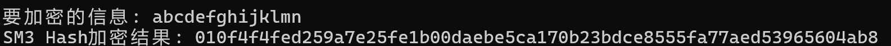
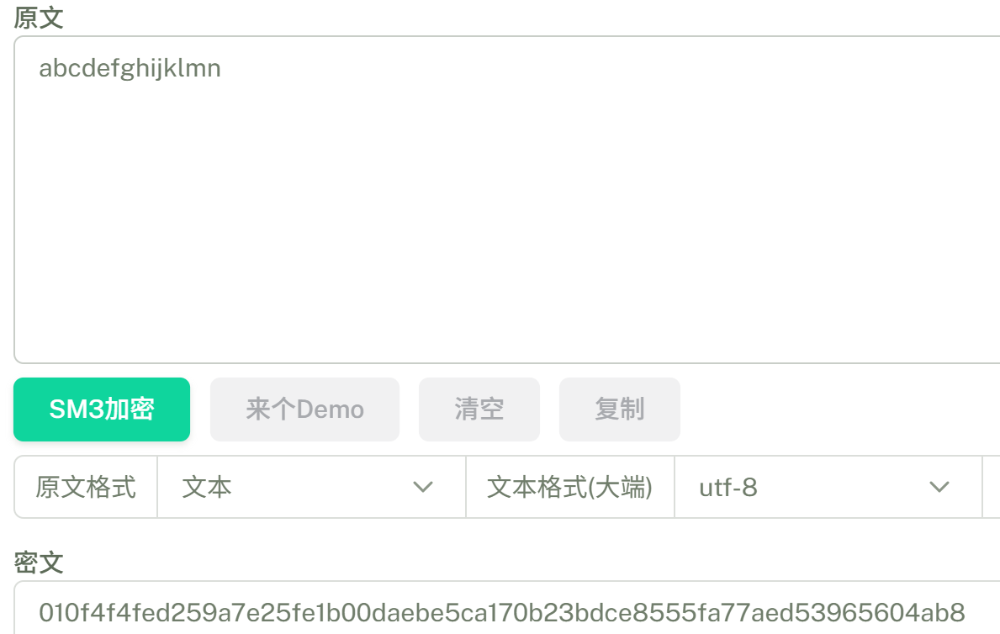
##### 2:**SM3的优化**
由于SM3采用了MD结构，每一块的运算基于上一块的哈希结果，因此在块与块之间的压缩很难优化。而消息填充部分占用的资源很少，也没有优化的必要。这里把优化重心放在SM3的压缩函数上。其可分为2部分，第一部分为消息拓展，第二部分为消息压缩。

对于消息拓展部分，观察其计算方法，发现每次能够同时进行三个数据的计算
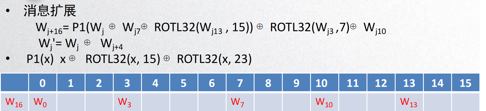
因此，这里考虑使用SIMD优化，首先将buf作为W的前16位输入导入xmm
```c++
//压缩函数
void sm3_pro_compress(sm3_ctx* ctx) {
	__m128i xmm[16] = {0},tmp;
	uint32_t W1[64] = {0};
	uint32_t W[64] = { 0 };

	xmm[0] = _mm_loadu_si128((const __m128i*)(ctx->buf + 0));   // 字 0,1,2,3
	xmm[1] = _mm_loadu_si128((const __m128i*)(ctx->buf + 12));  // 字 3,4,5,6
	xmm[2] = _mm_loadu_si128((const __m128i*)(ctx->buf + 24));  // 字 6,7,8,9
	xmm[3] = _mm_loadu_si128((const __m128i*)(ctx->buf + 36));  // 字 9,10,11,12
	xmm[4] = _mm_loadu_si128((const __m128i*)(ctx->buf + 48));  // 字 12,13,14,15

	//换为大端序
	__m128i vindex = _mm_setr_epi8(3, 2, 1, 0, 7, 6, 5, 4, 11, 10, 9, 8, 15, 14, 13, 12);
	xmm[0] = _mm_shuffle_epi8(xmm[0], vindex);
	xmm[1] = _mm_shuffle_epi8(xmm[1], vindex);
	xmm[2] = _mm_shuffle_epi8(xmm[2], vindex);
	xmm[3] = _mm_shuffle_epi8(xmm[3], vindex);
	xmm[4] = _mm_shuffle_epi8(xmm[4], vindex);
```
注意，这里导入时，xmm0导入字0，1，2，3；xmm1导入3，4，5，6，以此类推。如此一来，每次更新一个xmm（例如更新xmm5为字15，16，17，18）实际上都更新了3个字，这样写利于维护数组的统一。

然后是每轮W数组与Wi的更新，这里采取的策略如下：
以前两轮为例，第一轮使用xmm0到xmm4计算下三个W的值并存储于xmm5；通过xmm0的前3位与xmm1的后三位异或，结果存于xmm15，然后导入Wi的三位；提取出xmm0的前三位更新W的三位。
```c++
	//消息拓展
	// 
	// 第1段
	_mm_storeu_si128((__m128i*)W, xmm[0]);
	xmm[7] = ROTL_32(xmm[4], 15);
	xmm[7] = _mm_xor_si128(xmm[7], xmm[2]);
	xmm[7] = _mm_shuffle_epi32(xmm[7], _MM_SHUFFLE(0, 3, 2, 1));
	xmm[6] = _mm_xor_si128(xmm[7], xmm[0]);
	xmm[7] = ROTL_32(xmm[6], 23);
	xmm[9] = ROTL_32(xmm[6], 15);
	xmm[6] = _mm_xor_si128(xmm[6], xmm[7]);
	xmm[6] = _mm_xor_si128(xmm[6], xmm[9]);
	xmm[5] = _mm_shuffle_epi32(xmm[3], _MM_SHUFFLE(0, 3, 2, 1));
	xmm[9] = ROTL_32(xmm[1], 7);
	xmm[9] = _mm_xor_si128(xmm[9], xmm[5]);
	xmm[15] = _mm_xor_si128(xmm[0], _mm_shuffle_epi32(xmm[1], _MM_SHUFFLE(0, 3, 2, 1)));
	xmm[0] = _mm_xor_si128(xmm[6], xmm[9]);
	xmm[5] = _mm_alignr_epi8(xmm[0], xmm[4], 12);
	_mm_storeu_si128((__m128i*)W1, xmm[15]);
```
这一段是根据下面老师PPT中的代码制作的。但实际实现中发现老师给的这一段是有问题的，后几步的计算是错误的。后面根据自己的理解对其做了修改，纠正了一些错误，然后实现了对W和Wi的导出
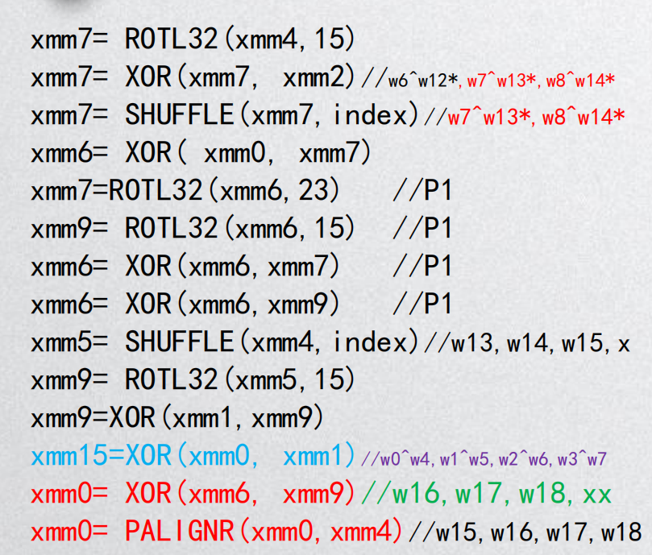

对于第二轮，可以看出，经过第一轮的运算，有效数据已经从xmm0到xmm4变为了xmm1到xmm5，以此将其中所有的运算中数字的编号+1并对16取余。后面的轮数以此类推。
```c++
	// 第2段
	_mm_storeu_si128((__m128i*)(W + 3), xmm[1]);
	xmm[8] = ROTL_32(xmm[5], 15);
	xmm[8] = _mm_xor_si128(xmm[8], xmm[3]);
	xmm[8] = _mm_shuffle_epi32(xmm[8], _MM_SHUFFLE(0, 3, 2, 1));
	xmm[7] = _mm_xor_si128(xmm[8], xmm[1]);
	xmm[8] = ROTL_32(xmm[7], 23);
	xmm[10] = ROTL_32(xmm[7], 15);
	xmm[7] = _mm_xor_si128(xmm[7], xmm[8]);
	xmm[7] = _mm_xor_si128(xmm[7], xmm[10]);
	xmm[6] = _mm_shuffle_epi32(xmm[4], _MM_SHUFFLE(0, 3, 2, 1));
	xmm[10] = ROTL_32(xmm[2], 7);
	xmm[10] = _mm_xor_si128(xmm[10], xmm[6]);
	xmm[0] = _mm_xor_si128(xmm[1], _mm_shuffle_epi32(xmm[2], _MM_SHUFFLE(0, 3, 2, 1)));
	xmm[1] = _mm_xor_si128(xmm[7], xmm[10]);
	xmm[6] = _mm_alignr_epi8(xmm[1], xmm[5], 12); // W19-W21
	_mm_storeu_si128((__m128i*)(W1+3), xmm[0]);
```
此处需要计算W[16~68]一共52个数，每轮计算3个，因此是18轮的运算。第18轮时导入剩余的未导入的数据。至此完成消息拓展部分的优化
```c++
	// 第18段
	_mm_storeu_si128((__m128i*)(W + 51), xmm[1]);
	_mm_storeu_si128((__m128i*)(W + 54), xmm[2]);
	_mm_storeu_si128((__m128i*)(W + 57), xmm[3]);
	_mm_storeu_si128((__m128i*)(W + 60), xmm[4]);
	_mm_storeu_si32((__m128i*)(W + 63), xmm[5]);
	xmm[8] = ROTL_32(xmm[5], 15);
	xmm[8] = _mm_xor_si128(xmm[8], xmm[3]);
	xmm[8] = _mm_shuffle_epi32(xmm[8], _MM_SHUFFLE(0, 3, 2, 1));
	xmm[7] = _mm_xor_si128(xmm[8], xmm[1]);
	xmm[8] = ROTL_32(xmm[7], 23);
	xmm[10] = ROTL_32(xmm[7], 15);
	xmm[7] = _mm_xor_si128(xmm[7], xmm[8]);
	xmm[7] = _mm_xor_si128(xmm[7], xmm[10]);
	xmm[6] = _mm_shuffle_epi32(xmm[4], _MM_SHUFFLE(0, 3, 2, 1));
	xmm[10] = ROTL_32(xmm[2], 7);
	xmm[10] = _mm_xor_si128(xmm[10], xmm[6]);
	xmm[0] = _mm_xor_si128(xmm[1], _mm_shuffle_epi32(xmm[2], _MM_SHUFFLE(0, 3, 2, 1)));
	xmm[1] = _mm_xor_si128(xmm[7], xmm[10]);
	xmm[6] = _mm_alignr_epi8(xmm[1], xmm[5], 12); // W67-W69
	_mm_storeu_si128((__m128i*)(W1 + 51), xmm[0]);
	_mm_storeu_si128((__m128i*)(W1 + 54), _mm_xor_si128(xmm[2], _mm_shuffle_epi32(xmm[3], _MM_SHUFFLE(0, 3, 2, 1))));
	_mm_storeu_si128((__m128i*)(W1 + 57), _mm_xor_si128(xmm[3], _mm_shuffle_epi32(xmm[4], _MM_SHUFFLE(0, 3, 2, 1))));
	_mm_storeu_si128((__m128i*)(W1 + 60), _mm_xor_si128(xmm[4], _mm_shuffle_epi32(xmm[5], _MM_SHUFFLE(0, 3, 2, 1))));
	_mm_storeu_si32((__m128i*)(W1 + 63), _mm_xor_si128(xmm[5], _mm_shuffle_epi32(xmm[6], _MM_SHUFFLE(0, 3, 2, 1))));
```
然后是消息压缩部分，将每轮的流程简化为下图形式：
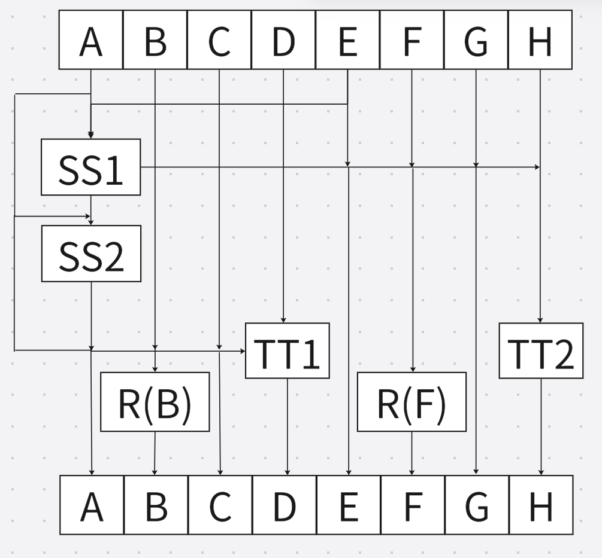
可以观察到，TT1与TT2，R（B）与R（F）分别可以并行执行。这里使用OpenMP库来实现并行

而且每轮结束时所做的重新赋值完全可以省略，将A，C保持变，B经过移位后储存于原位，D赋值为TT1，在下一轮时将D视为A，A视为B，B视为C，C视为D，即可完成正确的流程。也可以发现，经过四轮后，寄存器的位置会回归正确，而sm3的消息压缩为64轮，是4的倍数，因此最终位置是正确的
```c++
		D = C;
		C = ROTL(B, 9);
		B = A;
		A = TT1;
		H = G;
		G = ROTL(F, 19);
		F = E;
		E = P_0(TT2);
```
因此，有如下优化：
每4轮：
```c++
	//round1
	SS1 = ROTL((ROTL(A, 12) + E + ROTL(T_0, 0)), 7);
	SS2 = SS1 ^ ROTL(A, 12);
#pragma omp sections
	{
#pragma omp section
		{ D = FF_0(A, B, C) + D + SS2 + W1[0]; }

#pragma omp section
		{ H = P_0(GG_0(E, F, G) + H + SS1 + W[0]); }
	}

#pragma omp sections
	{
#pragma omp section
		{ B = ROTL(B, 9); }

#pragma omp section
		{ F = ROTL(F, 19); }
	}

	//round2
	SS1 = ROTL((ROTL(D, 12) + H + ROTL(T_0, 1)), 7);
	SS2 = SS1 ^ ROTL(D, 12);
#pragma omp sections
	{
#pragma omp section
		{ C = FF_0(D, A, B) + C + SS2 + W1[1]; }

#pragma omp section
		{ G = P_0(GG_0(H, E, F) + G + SS1 + W[1]); }
	}

#pragma omp sections
	{
#pragma omp section
		{ A = ROTL(A, 9); }

#pragma omp section
		{ E = ROTL(E, 19); }
	}

	//round3
	SS1 = ROTL((ROTL(C, 12) + G + ROTL(T_0, 2)), 7);
	SS2 = SS1 ^ ROTL(C, 12);
#pragma omp sections
	{
#pragma omp section
		{ B = FF_0(C, D, A) + B + SS2 + W1[2]; }

#pragma omp section
		{ F = P_0(GG_0(G, H, E) + F + SS1 + W[2]); }
	}

#pragma omp sections
	{
#pragma omp section
		{ D = ROTL(D, 9); }

#pragma omp section
		{ H = ROTL(H, 19); }
	}

	//round4
	SS1 = ROTL((ROTL(B, 12) + F + ROTL(T_0, 3)), 7);
	SS2 = SS1 ^ ROTL(B, 12);
#pragma omp sections
	{
#pragma omp section
		{ A = FF_0(B, C, D) + A + SS2 + W1[3]; }

#pragma omp section
		{ E = P_0(GG_0(F, G, H) + E + SS1 + W[3]); }
	}

#pragma omp sections
	{
#pragma omp section
		{ C = ROTL(C, 9); }

#pragma omp section
		{ G = ROTL(G, 19); }
	}
```

注意前16轮与后48轮所使用的T与FF，GG函数有差别，需替换。

17轮以后相应函数与常量替换：
```c++
	//round17
	SS1 = ROTL((ROTL(A, 12) + E + ROTL(T_1, 16)), 7);
	SS2 = SS1 ^ ROTL(A, 12);
#pragma omp sections
	{
#pragma omp section
		{ D = FF_1(A, B, C) + D + SS2 + W1[16]; }

#pragma omp section
		{ H = P_0(GG_1(E, F, G) + H + SS1 + W[16]); }
	}

#pragma omp sections
	{
#pragma omp section
		{ B = ROTL(B, 9); }

#pragma omp section
		{ F = ROTL(F, 19); }
	}
```
其中的
```c++
#pragma omp sections
{
    #pragma omp section
    { /* Task A */ }
          
    #pragma omp section
    { /* Task B */ }
}
```
表示任务的分配，其分配的任务并行执行

压缩函数的最后一步异或iv也可以并行执行
```c++
	// V(i+1) = ABCDEFGH ^ V(i)

#pragma omp sections
	{
#pragma omp section
		{ ctx->state[0] ^= A; }
#pragma omp section
		{ ctx->state[1] ^= B; }
#pragma omp section
		{ ctx->state[2] ^= C; }
#pragma omp section
		{ ctx->state[3] ^= D; }
#pragma omp section
		{ ctx->state[4] ^= E; }
#pragma omp section
		{ ctx->state[5] ^= F; }
#pragma omp section
		{ ctx->state[6] ^= G; }
#pragma omp section
		{ ctx->state[7] ^= H; }
	}
```

测试函数：
```c++
void sm3_pro(unsigned char* input, unsigned int iLen, unsigned char* output){
	sm3_ctx ctx;
	sm3_init(&ctx);
	sm3_pro_input(&ctx, input, iLen);
	sm3_pro_do(&ctx, output);
}

void sm3_pro_test() {
	unsigned char input[] = "abcdefghijklmnabcdefghijklmnabcdefghijklmnabcdefghijklmnabcdefghijklmnabcdefghijklmnabcdefghijklmnabcdefghijklmnabcdefghijklmnabcdefghijklmn";
	unsigned char output[32];
	sm3_pro(input, sizeof(input) - 1, output);
	cout << "要加密的信息: " << input << endl;
	cout << "SM3 Hash_pro加密结果: ";
	for (int i = 0; i < 32; i++) {
		cout << hex << setw(2) << setfill('0') << (int)output[i];
	}
	cout << endl;
}
```
可以看出，优化后的哈希结果与优化前相同，因此优化流程是正确的
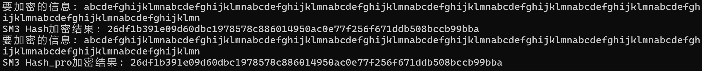
#### b) SM3验证长度拓展攻击
首先使用SM3编写MAC，根据长度拓展攻击需求，MAC生成方式为 Hash(key||msg)
```c++
void MAC(unsigned char* msg,size_t msg_size, unsigned char* key, size_t key_size ,unsigned char* output) { //MAC生成
	unsigned char* key_msg = new unsigned char[msg_size + key_size];
	memcpy(key_msg, key, key_size);
	memcpy(key_msg + key_size, msg, msg_size);
	sm3(key_msg, msg_size + key_size, output);//hash(key||msg)
}
```

然后编写MAC验证函数
```c++
bool MAC_verfly(unsigned char* msg, size_t msg_size, unsigned char* key, size_t key_size, unsigned char* mac) {//MAC验证
	unsigned char* key_msg = new unsigned char[msg_size + key_size];
	unsigned char hash[32];
	memcpy(key_msg, key, key_size);
	memcpy(key_msg + key_size, msg, msg_size);
	sm3(key_msg, msg_size + key_size, hash);
	if (memcmp(hash, mac, 32) == 0) {
		return true;
	}
	else return false;
}
```
编写随机消息生成函数用于测试，输入消息地址与数据长度，在输入的地址上写入随机消息
```c++
//随机消息生成函数
void msg_get(unsigned char* output,size_t size) {
	const char alphanumeric_chars[] = "0123456789ABCDEFGHIJKLMNOPQRSTUVWXYZabcdefghijklmnopqrstuvwxyz";
	std::random_device rd;
	std::default_random_engine generator(rd());
	std::uniform_int_distribution<size_t> distribution(0, sizeof(alphanumeric_chars) - 2);
	for (int i = 0; i < size; i++) {
		output[i] = alphanumeric_chars[distribution(generator)];
	}
}
```
MAC测试
```c++
void MAC_test() {
	unsigned char key[32];
	unsigned char msg[64];
	unsigned char mac[64];
	msg_get(key, 32);
	msg_get(msg, 64);
	MAC(msg, 64, key, 32, mac);
	cout << "key: ";
	for (int i = 0; i < 32; i++) {
		cout << hex << setw(2) << setfill('0') << (int)key[i];
	}
	cout << endl;
	cout << "msg: ";
	for (int i = 0; i < 64; i++) {
		cout << hex << setw(2) << setfill('0') << (int)msg[i];
	}
	cout << endl;
	cout << "mac: ";
	for (int i = 0; i < 32; i++) {
		cout << hex << setw(2) << setfill('0') << (int)mac[i];
	}
	cout << endl;
	if (MAC_verfly(msg, 64, key, 32, mac)) {
		cout << "MAC verification passed." << endl;
	}
	else {
		cout << "MAC verification failed." << endl;
	}
}
```

测试结果
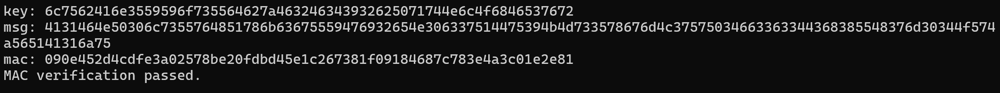
之后构造长度拓展攻击，流程如下：
1：得到消息msg以及msg对应的mac=Hash(key||msg)
2：得到key||msg的填充padding
3：产生附加消息S，构造出消息伪造msg_forge = msg||padding||S
4:对msg_forge产生填充padding_，将Hash(key||msg)作为SM3的iv输入，然后用此计算出S||padding_的哈希值得到mac_forge
```c++
//长度拓展攻击
unsigned char* MAC_forge(unsigned char* mac ,unsigned char* msg,size_t msg_size,size_t key_size,unsigned char* mac_forge,int* len) {
	//iv替换
	sm3_ctx* ctx = new sm3_ctx;
	sm3_init(ctx);
	for (int i = 0; i < 8; i++) {
		ctx->state[i] = ((uint32_t)mac[4 * i] << 24) | 
			((uint32_t)mac[4 * i + 1] << 16) |
			((uint32_t)mac[4 * i + 2] << 8) |
			((uint32_t)mac[4 * i + 3]); 
	}
	unsigned char msg_forge_tail[32];
	unsigned char* msg_padding;
	size_t padded_len;
	msg_get(msg_forge_tail, 32);//产生附加消息
	msg_padding = sm3_pad(msg_size + key_size, &padded_len);//计算key||msg的填充

	//msg||padding||S
	unsigned char* msg_forge_result = new unsigned char[msg_size + padded_len + 32];
	memcpy(msg_forge_result, msg, msg_size);
	memcpy(msg_forge_result + msg_size, msg_padding, padded_len);
	memcpy(msg_forge_result + msg_size + padded_len, msg_forge_tail, 32);
	*len = msg_size + padded_len + 32;

	//计算key||msg||padding||S的填充
	unsigned char* msg_forge_padding;
	size_t padded_len_;
	msg_forge_padding = sm3_pad(key_size + msg_size + padded_len + 32, &padded_len_);

	//计算Hash(S||padded_)得到伪造的MAC
	unsigned char* msg_for_mac_forge = new unsigned char[32 + padded_len_];
	memcpy(msg_for_mac_forge, msg_forge_tail, 32);
	memcpy(msg_for_mac_forge + 32, msg_forge_padding, padded_len_);

	for (int i = 0; i < 64; i++) {
		ctx->buf[i] = msg_for_mac_forge[i];
	}
	sm3_compress(ctx);
	GM_PUT_UINT32_BE(ctx->state[0], mac_forge, 0);
	GM_PUT_UINT32_BE(ctx->state[1], mac_forge, 4);
	GM_PUT_UINT32_BE(ctx->state[2], mac_forge, 8);
	GM_PUT_UINT32_BE(ctx->state[3], mac_forge, 12);
	GM_PUT_UINT32_BE(ctx->state[4], mac_forge, 16);
	GM_PUT_UINT32_BE(ctx->state[5], mac_forge, 20);
	GM_PUT_UINT32_BE(ctx->state[6], mac_forge, 24);
	GM_PUT_UINT32_BE(ctx->state[7], mac_forge, 28);

	return msg_forge_result;
}
```

返回伪造的消息，将对应的mac传入对应的指针

长度拓展攻击测试
```c++
void MAC_forge_test() {
	unsigned char msg[64];
	msg_get(msg, 64);
	unsigned char mac[32];
	unsigned char key[32];
	unsigned char* msg_forge;
	unsigned char mac_forge[32];
	int msg_forge_len = 0;
	msg_get(key, 32);
	sm3(msg, 64, mac);
	MAC(msg, 64, key, 32, mac);
	//MAC伪造
	msg_forge = MAC_forge(mac, msg, 64, 32, mac_forge,&msg_forge_len);
	cout << "MAC_forge_test result:"<<MAC_verfly(msg_forge, msg_forge_len, key, 32, mac_forge) << endl;
}
```
输出为1，表示伪造成功
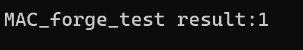
#### c) SM3构建merkle树，并构建叶子的存在性证明与不存在性证明
1：**SM3构建merkle树**
首先构造node，tree,leaf结构体，分别代表树的节点，树，以及树的叶子。node节点包含节点的哈希值，节点的高度，左右孩子，父母；tree包含树的根，树的叶子数组，以及叶子的数量；leaf包含对应的消息msg，以及消息链接的节点。
为了方便树的build，还构造了结构体floor。当叶子节点从下往上逐层计算节点时，存储每层的计算结果
```c++
//树节点，包含哈希值，节点层次，左右子节点及父节点指针
struct merkletree_node {
	unsigned char hash[64];
	int level = 0;
	merkletree_node* left ;
	merkletree_node* right ;
	merkletree_node* parent =NULL;
};
//树叶子,包含消息和指向对应节点的指针
struct merkletree_leaf {
	merkletree_node* node ;
	unsigned char msg[64];
};
//树的层次，用于树的build
struct merkletree_floor {
	merkletree_node* node ;
	merkletree_floor* next ;
};
//树的整体结构，包含根节点，叶子节点数组和叶子节点数量
struct merkletree {
	merkletree_node* root ;
	merkletree_leaf* leaves;
	int leaf_size;
};

```
然后编写一些辅助函数，包括单个节点，树的层次，叶子节点，整棵树的打印函数。
```c++
//单个节点，树的层次，叶子节点，整棵树的打印函数
void node_print(merkletree_node* node);
void merkletree_floor_print(merkletree_floor* floor);
void merkletree_leaves_print(merkletree* tree);
void merkletree_print(merkletree_node* tree);
```

然后是树的build的过程。我把它分为3步
1：生成有序的叶子节点
2：合并出merkle树的最后一层
3：向上逐层计算每层的各个节点

生成有序的叶子节点：这里有序的目的是使merkle能完成不存在性证明的构造。这里使用了插入排序，先通过msg_get生成随机叶子信息，然后构建出叶子节点，将节点串入floor中作为叶子层，最后对叶子信息进行插入排序
```c++
void merkletree_build(merkletree* tree, int leaf_size) {
	// Set the leaf nodes
	merkletree_floor* head = new merkletree_floor;
	merkletree_floor* next = head;
	tree->leaves = new merkletree_leaf[leaf_size];
	tree->leaf_size = leaf_size;
	int nodes_index = 0;
	for (int i = 0; i < leaf_size; i++) {
		tree->leaves[i].node = new merkletree_node;
		msg_get(tree->leaves[i].msg);
		merkletree_floor* cur = new merkletree_floor;
		sm3(tree->leaves[i].msg, sizeof(tree->leaves[i].msg), tree->leaves[i].node->hash);
		cur->node = tree->leaves[i].node;
		cur->node->left = nullptr;
		cur->node->right = nullptr;
		next->next = cur;
		next = cur;
		merkletree_leaf_sort(tree, &i);
	}
	cout << "floor_setting:" << head->next->node->level<<"complete!" << endl;
    ……
}
```
其中实现插入排序的merkletree_leaf_sort函数，将tree的第i片叶子插入之前有序的i-1片叶子中；如果发现两片叶子相同，则重新产生一片新的叶子。定义如下
```c++
void merkletree_leaf_sort(merkletree* tree,int* end) {
	int i = *end;
	while (i > 0) {
		int b = memcmp(tree->leaves[i].msg, tree->leaves[i - 1].msg, 64);
		if (b < 0) {
			// Swap the leaves
			merkletree_leaf temp = tree->leaves[i];
			tree->leaves[i] = tree->leaves[i - 1];
			tree->leaves[i - 1] = temp;
			i--;
		}
		else if (b == 0) {
			delete tree->leaves[i].node;
			for (int j = i; j < *end - 1; j++) {
				tree->leaves[j] = tree->leaves[j + 1];
			}
			(*end)--;
			break;
		}
		else break;
	}
}
```

合并出merkle树的最后一层：这一步是根据merkle树完全二叉树的性质给出的。先计算如此数量的叶子构成的完全二叉树中，最后一层有多少个节点，只需确定k使得 $2^{k}<n<2^{k+1}$, 然后计算$n-2^k$即可。将这些节点全部合并到上一层，剩余的叶子节点高度提升1，便得到了一颗满二叉树的最后一层，最后逐层向上合并即可。
```c++
    // Build the tree
	int t = 1;
	while (t < leaf_size) {
		t *= 2;
	}
	int l = t/2;
	t = leaf_size - t / 2;
	next = head->next;
	for (int i = 0; i < t; i++) {
		merkletree_node* merge = new merkletree_node;
		merkletree_merge(next->node, next->next->node, merge);
		next->node = merge;
		next->next = next->next->next;
		next = next->next;
	}
	if (t != 0) {
		for (int i = 0; i < l - t; i++) {
			next->node->level = (next->node->level) + 1;
			next = next->next;
		}
	}
	cout << "floor_setting:" << head->next->node->level << "complete!" << endl;
	while (l > 1) {
		next = head->next;
		for (int i = 0; i < l / 2; i++) {
			merkletree_node* merge = new merkletree_node;
			merkletree_merge(next->node, next->next->node, merge);
			next->node = merge;
			next->next = next->next->next;
			next = next->next;
		}
		l = l / 2;
		cout << "floor_setting:" << head->next->node->level << "complete!" << endl;
	}
	cout <<"merkletree build complete!\n" << endl;
	tree->root = head->next->node;
}
```
其中节点的合并操作由merge函数实现
```c++
void merkletree_merge(merkletree_node* left, merkletree_node* right, merkletree_node* parent) {
	// Concatenate the hashes of the left and right nodes
	unsigned char combined_hash[64];
	memcpy(combined_hash, left->hash, 32);
	memcpy(combined_hash + 32, right->hash, 32);
	// Process the combined hash
	sm3(combined_hash, sizeof(combined_hash) - 1, parent->hash);
	left->parent = parent;
	right->parent = parent;
	parent->left = left;
	parent->right = right;
	parent->level = max(left->level, right->level) + 1;
}
```
merkletree_build函数功能测试：
```c++
void merkletree_build_test() {
	cout << "----------------merkletree生成测试----------------\n";
	merkletree* root = new merkletree;
	merkletree_build(root, 10);
	cout << "Merkle Tree Structure:\n";
	merkletree_print(root->root);
	cout << "Leaves:\n";
	merkletree_leaves_print(root);
	cout << endl;
}
```
结果如下，打印方式为先序遍历。
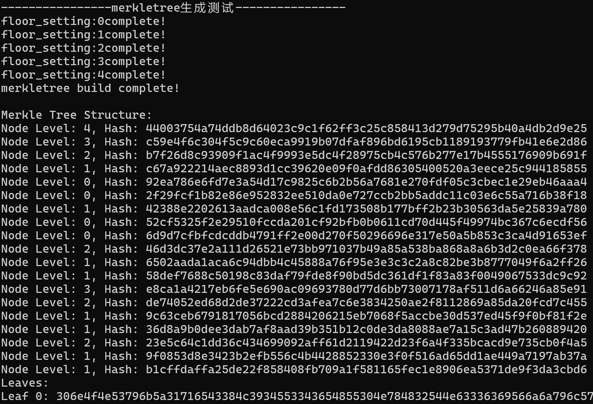
2：**叶子的存在性证明**
首先判断消息是否真实存在，在叶子中查找是否有此消息。若无，则输出消息不存在。若有，则找到对应的那片叶子。由于叶子顺序排列，因此从左往右查找到其中比此消息字典序更大的叶子即可确定不存在。之后构建存在性证明，给予消息向上构筑出根节点哈希值的路径。在每个哈希的末尾提供判定位，使得证明验证时能正确分辨哈希顺序。
```c++
//存在性证明
vector<unsigned char*> InclusionProof_Set(unsigned char* msg, merkletree* root) {
	int index = 0;
	vector<unsigned char*> proof;
	for (int i = 0; i < root->leaf_size; i++) {
		if (memcmp(msg, root->leaves[i].msg, 64) < 0) {
			cout << "消息不存在" << endl;
			return proof;
		}
		//消息存在，提供存在性证明
		else if (memcmp(msg, root->leaves[i].msg, 64) == 0) {
			index = i;
			break;
		}
	}
	merkletree_node* current = root->leaves[index].node;
	while (current->parent != NULL) {
		unsigned char* sibling = new unsigned char[65];
		if (current->parent->left == current) {
			memcpy(sibling, current->parent->right->hash, 64);
			sibling[64] = '0';
		}
		else {
			memcpy(sibling, current->parent->left->hash, 64);
			sibling[64] = '1';
		}
		proof.push_back(sibling);
		current = current->parent;
	}
	return proof;
}
```


接下来是证明的验证。通过判定位确定哈希的方式是$Hash(proof[i]||hash)$还是$Hash(hash||proof[i])$一轮轮向上哈希直到得到根节点的哈希值，最后与原根节点的哈希值比较，若相同则证明成功
```c++
bool InclusionProof_Verify(unsigned char* msg, vector<unsigned char*> proof, merkletree* root) {
	unsigned char hash[64];
	unsigned char msg_[64];
	memcpy(msg_, msg, 64);
	sm3(msg_,sizeof(msg_), hash);
	if (proof.size() == 0) {
		return false; // 证明无效
	}
	for (size_t i = 0; i < proof.size();i++) {
		unsigned char combined_hash[64];
		if (proof[i][64] == '0') {
			memcpy(combined_hash, hash, 32);
			memcpy(combined_hash + 32, proof[i], 32);
			sm3(combined_hash, sizeof(combined_hash) - 1, hash);
		}
		else {
			memcpy(combined_hash, proof[i], 32);
			memcpy(combined_hash + 32, hash, 32);
			sm3(combined_hash, sizeof(combined_hash) - 1, hash);
		}
		cout << "the " << i << "th hash result:";
		for (int j = 0; j < 32; j++) {
			cout << hex << setw(2) << setfill('0') << (int)hash[j];
		}
		cout << endl;
	}
	cout << "root hash:";
	for (int j = 0; j < 32; j++) {
		cout << hex << setw(2) << setfill('0') << (int)root->root->hash[j];
	}
	cout << endl;
	if (memcmp(hash, root->root->hash, 32) == 0) {
		return true; // 验证成功
	}
	else return false; // 验证失败
}
```
- 消息错误与正确的情况的两种情况的存在性证明测试如下：
```c++
void merkletree_InclusionProof_test() {
	cout << "----------------存在性证明测试----------------\n";
	merkletree* root = new merkletree;
	merkletree_build(root, 3);
	vector<unsigned char*> proof = InclusionProof_Set(root->leaves[1].msg, root);
	cout << "Verfiy result:" << InclusionProof_Verify(root->leaves[1].msg, proof, root) << endl;

	cout << endl;
	proof = InclusionProof_Set(root->leaves[1].msg, root);
	cout << "Verfiy result:" << InclusionProof_Verify(root->leaves[1].msg, proof, root) << endl;
}
```
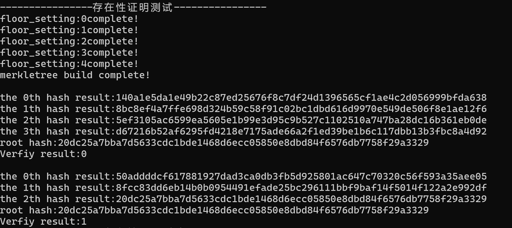
3：**叶子的不存在性证明**
不存在性证明对比存在性证明更复杂，经对比分析，可借助存在性证明来完成不存在性证明。
不存在证明需要提供相邻的$msg1$与$msg2$，使得需证明不存在的消息$msg$满足$msg1<msg<msg2$,然后通过$msg1$与$msg2$给出一条建立根节点哈希的路线，相当于提供$msg1$的存在性证明。
因此，实现不存在性证明的过程如下：
1：确定消息位置。如果消息存在，则退出
```c++
//不存在性证明
vector<unsigned char*> ExclusionProof_Set(unsigned char* msg, merkletree* root) {
	int index = root->leaf_size-1;
	vector<unsigned char*> proof;
	for (int i = 0; i < root->leaf_size; i++) {
		if (memcmp(msg, root->leaves[i].msg, 64) < 0) {
			index = i;
			break;
		}
		//消息存在
		else if (memcmp(msg, root->leaves[i].msg, 64) == 0) {
			cout << "消息并非不存在" << endl;
			return proof;
		}
	}
```

2：消息位置分三种情况，(1)小于所有叶子，(2)大于所有叶子，(3)在两片叶子之间。对于三种情况给出不同的处理。
(1)：证明包含leaf[0]的存在性证明，leaf[0]的哈希值，全0消息，leaf[0]中的消息
```c++
	unsigned char* zero = new unsigned char[64];
	unsigned char* max = new unsigned char[64];
	memset(zero, 0x00, 64);
	memset(max, 0xFF, 64);
	if (index == 0) {
		proof = InclusionProof_Set(root->leaves[0].msg, root);
		unsigned char* hash = new unsigned char[64];
		sm3(root->leaves[0].msg, sizeof(root->leaves[0].msg), hash);
		proof.push_back(hash);
		proof.push_back(zero);
		proof.push_back(root->leaves[0].msg);
		return proof;
	}
```

(2)：证明包含leaf[leaf_size - 1]的存在性证明，leaf[leaf_size - 1]的哈希值，leaf[leaf_size - 1]中的消息，全f消息max
```c++
	else if (index == root->leaf_size - 1) {
		proof = InclusionProof_Set(root->leaves[root->leaf_size - 1].msg, root);
		unsigned char* hash = new unsigned char[64];
		
		sm3(root->leaves[root->leaf_size - 1].msg, sizeof(root->leaves[root->leaf_size - 1].msg), hash);
		proof.push_back(hash);
		proof.push_back(root->leaves[root->leaf_size - 1].msg);
		proof.push_back(max);
		return proof;
	}
```
(3):证明包含leaf[i]的存在性证明，leaf[i]的哈希值，leaf[i]中的消息，leaf[i+1]中的消息
```c++
	else {
		proof = InclusionProof_Set(root->leaves[index].msg, root);
		unsigned char* hash = new unsigned char[64];
		sm3(root->leaves[index].msg, sizeof(root->leaves[index].msg), hash);
		proof.push_back(hash);
		proof.push_back(root->leaves[index - 1].msg);
		proof.push_back(root->leaves[index].msg);
		return proof;
	}
```
由上述讨论可得，三种情况最后两项都满足$msg1<msg<msg2$，倒数第3项是$msg1$的哈希，前面则是其对应的存在性证明。因此，证明验证按以下步骤进行：
1：判断$msg1<msg<msg2$是否满足。
```c++
bool ExclusionProof_Verify(unsigned char* msg, vector<unsigned char*> proof, merkletree* root) {
	size_t n = proof.size();
	if (n < 3) {
		return false; // 证明无效
	}
	unsigned char hash[64];
	cout << "msg:";
	for (int j = 0; j < 64; j++) {
		cout << hex << setw(2) << setfill('0') << (int)msg[j];
	}
	cout << endl;

	cout << "leaf < msg:";
	for (int j = 0; j < 64; j++) {
		cout << hex << setw(2) << setfill('0') << (int)proof[n - 2][j];
	}
	cout << endl;

	cout << "leaf > msg:";
	for (int j = 0; j < 64; j++) {
		cout << hex << setw(2) << setfill('0') << (int)proof[n - 1][j];
	}
	cout << endl;
```
2：根据$msg1$的哈希以及其存在性证明建立哈希路径，得到根节点的哈希，并与原来根节点中的哈希作比较

```c++
	if (memcmp(proof[n - 2], msg, 64) < 0 and memcmp(proof[n - 1], msg, 64) > 0 or
		memcmp(proof[n - 2], msg, 64) == 0 or memcmp(proof[n - 1], msg, 64) == 0) {
		memcpy(hash, proof[n - 3], 64);
		for (size_t i = 0; i < n - 3; i++) {
			unsigned char combined_hash[64];
			if (proof[i][64] == '0') {
				memcpy(combined_hash, hash, 32);
				memcpy(combined_hash + 32, proof[i], 32);
				sm3(combined_hash, sizeof(combined_hash) - 1, hash);
			}
			else {
				memcpy(combined_hash, proof[i], 32);
				memcpy(combined_hash + 32, hash, 32);
				sm3(combined_hash, sizeof(combined_hash) - 1, hash);
			}
			cout << "the "<<i<<"th hash result:";
			for (int j = 0; j < 32; j++) {
				cout << hex << setw(2) << setfill('0') << (int)hash[j];
			}
			cout << endl;
		}
		cout << "root hash:";
		for (int j = 0; j < 32; j++) {
			cout << hex << setw(2) << setfill('0') << (int)root->root->hash[j];
		}
		cout << endl;
		if (memcmp(hash, root->root->hash, 32) == 0) {
			return true; // 验证成功
		}
		else return false; // 验证失败
	}
```
- 不存在性证明测试如下
```c++
void merkletree_ExclusionProof_test(){
	cout << "----------------不存在性证明测试----------------\n";
	merkletree* root = new merkletree;
	merkletree_build(root, 10);
	unsigned char hash[64];
	unsigned char msg[64] = {0};
	msg_get(msg);
	vector<unsigned char*> proof = ExclusionProof_Set(msg, root);
	cout <<"Verfiy result:"<< ExclusionProof_Verify(msg, proof, root) << endl;
}
```
测试结果如下：
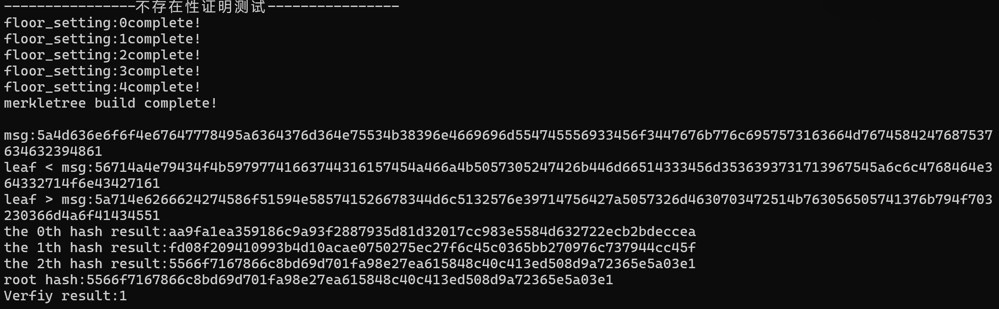

最后是题目中要求的建立10万个节点的merkle树
```c++
void merkletree_100000_test() {
	cout << "----------------100000节点Merkle树测试----------------\n";
	merkletree* root = new merkletree;
	merkletree_build(root, 100000);
	cout << "----------------存在性证明测试----------------\n";
	vector<unsigned char*> proof = InclusionProof_Set(root->leaves[1].msg, root);
	cout << "Verfiy result:" << InclusionProof_Verify(root->leaves[1].msg, proof, root) << endl;
	cout << "----------------不存在性证明测试----------------\n";
	unsigned char msg[64] = { 0 };
	msg_get(msg);
	proof = ExclusionProof_Set(msg, root);
	cout << "Verfiy result:" << ExclusionProof_Verify(msg, proof, root) << endl;
}
```
由于第一轮的叶子节点生成以及排序开销非常大，故构建过程过大。最后成功生成了一颗18层的merkle树。
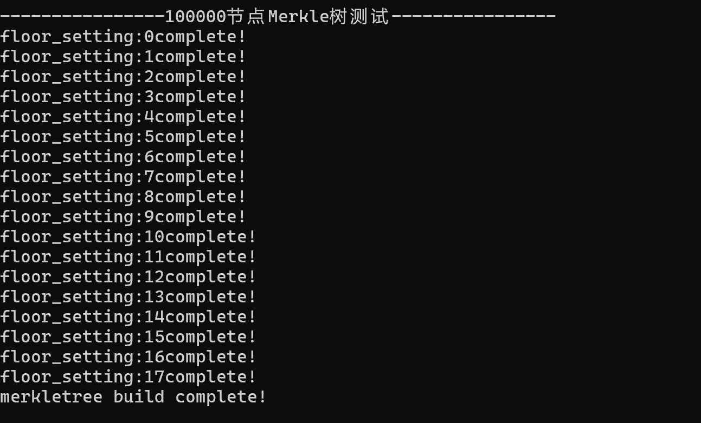
下述结果表明存在性证明与非存在性证明的效率都非常高。
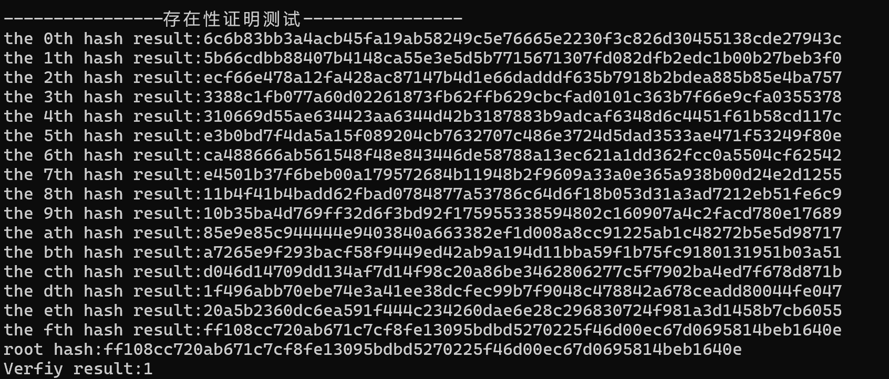
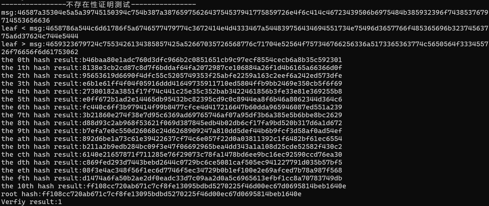