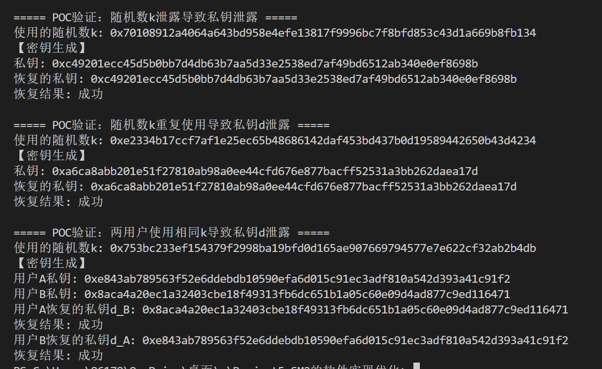

## Project 5: b). SM2 签名算法误用场景的 POC 验证
#### 项目分工
| 姓名 | 分工                     |
|-------|--------------------------|
|  崔倡通  | 代码编写及测试   |
|  童皓琛   |  原理总结及报告编写           |

### 项目简介
本项目验证了SM2签名算法在以下误用场景下的安全性影响并给出了相应推导文档以及验证代码：
1. 随机数$k$泄露导致私钥$d$泄露
2. 随机数$k$重复使用导致私钥$d$泄露
3. 两用户使用相同$k$导致私钥泄露

### 项目内容
#### 1. 随机数k泄露导致私钥d泄露
#### (1).推导文档
在给定$\sigma = (r,s)$和$k$的情况下计算$d_A$计算过程如下：
- \(s = ((1+d_A)^{-1} \cdot (k-r\cdot d_A)) \mod n \)
- $s\cdot(1+d_A) = (k-r\cdot d_A) \mod n$
- $(r+s)\cdot d_A = (k-s) \mod n$
- $ d_A = (r+s)^{-1}\cdot(k-s) \mod n$

#### (2).验证代码
```python
def POC_SM2_sig_leaking_k():
    """POC验证：随机数k泄露导致私钥泄露"""
    print("\n===== POC验证：随机数k泄露导致私钥泄露 =====")
    private_key, pub_x, pub_y = SM2.key()
    # 生成签名并记录使用的k值
    test_msg = b"Hello, SM2!"  # 固定测试消息
    k = SM2.getRandomRange(1, n - 1)  # 生成随机数 k ∈ [1, n-1]
    user_id = "test_user"      # 用户标识
    signature = SM2.sm2_sign(test_msg, user_id, private_key, pub_x, pub_y,k)
    r, s = signature
    print(f"使用的随机数k: {hex(k)}")
    print(f"【密钥生成】\n私钥: 0x{private_key:064x}")
    # 从泄露的k恢复私钥: dA = (k - s) * (s + r)^(-1) mod n
    denominator = (s + r) % SM2.n

    inv_denom = inverse(denominator, n)
    recovered_private = ((k - s) * inv_denom) % n

    print(f"恢复的私钥: {hex(recovered_private)}")
    print(f"恢复结果: {'成功 ' if private_key == recovered_private else '失败'}")
```
#### 2. 随机数k重复使用导致私钥d泄露
#### (1).推导文档
同一用户对消息$M_1$和$M_2$使用相同$k$ 生成签名：
- $s_1= ((1+d_A)^{-1} \cdot (k-r_1 \cdot d_A)) \mod n$
- $s_2= ((1+d_A)^{-1} \cdot (k-r_2 \cdot d_A)) \mod n$
将两式相减移项得
$d_A=(s_2-s_1)(s_1-s_2+r_1-r_2)^{-1} \mod n$
#### (2).验证代码
```python
def POC_SM2_sig_sameuser_reusing_k():
    """POC验证：随机数k重复使用导致私钥d泄露"""
    print("\n===== POC验证：随机数k重复使用导致私钥d泄露 =====")
    private_key, pub_x, pub_y = SM2.key()
    # 生成签名并记录使用的k值
    msg1 = b"Hello, SM2A!"
    msg2 = b"Hello, SM2B!"
    k = SM2.getRandomRange(1, n - 1)  # 生成随机数 k ∈ [1, n-1]
    user_id = "test_user"      # 用户标识
    print(f"使用的随机数k: {hex(k)}")
    print(f"【密钥生成】\n私钥: 0x{private_key:064x}")
    signature1 = SM2.sm2_sign(msg1, user_id, private_key, pub_x, pub_y,k)
    signature2 = SM2.sm2_sign(msg2, user_id, private_key, pub_x, pub_y,k)
    
    r1, s1 = signature1
    r2, s2 = signature2
     # 推导公式：dA = (s2 - s1) / (s1 - s2 + r1 - r2) mod n
    numerator = (s2 - s1) % n
    denominator = (s1 - s2 + r1 - r2) % n
    inv_denom = inverse(denominator, n)
    recovered_private = numerator * inv_denom % n
    print(f"恢复的私钥: {hex(recovered_private)}")
    print(f"恢复结果: {'成功 ' if private_key == recovered_private else '失败'}")
```
#### 3. 两用户使用相同k导致私钥相互推导
#### (1).推导文档
用户A和用户B使用相同的$k$生成签名：
- $s_1= ((1+d_A)^{-1} \cdot (k-r_1 \cdot d_A)) \mod n$
- $s_2= ((1+d_B)^{-1} \cdot (k-r_2 \cdot d_B)) \mod n$
则用户A和用户B可根据上述等式推导出对方的私钥：

- $d_B=(k-s_2) \cdot (s_2+r_2)^{-1}  \mod n$
- $d_A=(k-s_1) \cdot (s_1+r_1)^{-1}  \mod n$
#### (2).验证代码
```python
def POC_SM2_sig_diff_user_reusing_k():
    """POC验证：两用户使用相同k导致私钥d泄露"""
    print("\n===== POC验证：两用户使用相同k导致私钥d泄露 =====")
    private_keyA, pubA_x, pubA_y = SM2.key()
    private_keyB, pubB_x, pubB_y = SM2.key()
    user_id = "userA"      # 用户A标识
    user_id = "userB"      # 用户A标识
    k = SM2.getRandomRange(1, n - 1)  # 生成随机数 k ∈ [1, n-1]
    msgA = b"Hello, SM2A!"
    msgB = b"Hello, SM2B!"
    print(f"使用的随机数k: {hex(k)}")
    print(f"【密钥生成】\n用户A私钥: 0x{private_keyA:064x}")
    print(f"用户B私钥: 0x{private_keyB:064x}")
    signatureA = SM2.sm2_sign(msgA, user_id, private_keyA, pubA_x, pubA_y,k)
    signatureB = SM2.sm2_sign(msgB, user_id, private_keyB, pubB_x, pubB_y,k)
    
    r1, s1 = signatureA
    r2, s2 = signatureB
    # 恢复用户B的私钥
    denominator = (s2 + r2) % n
    inv_denom = inverse(denominator, n)
    recovered_private_B = ((k - s2) * inv_denom) % n
    print(f"用户A恢复的私钥d_B: {hex(recovered_private_B)}")
    print(f"恢复结果: {'成功 ' if private_keyB == recovered_private_B else '失败'}")
    # 恢复用户A的私钥
    denominator = (s1 + r1) % n
    inv_denom = inverse(denominator, n)
    recovered_private_A = ((k - s1) * inv_denom) % n
    print(f"用户B恢复的私钥d_A: {hex(recovered_private_A)}")
    print(f"恢复结果: {'成功 ' if private_keyA == recovered_private_A else '失败'}")
```
#### 4. 测试样例结果

