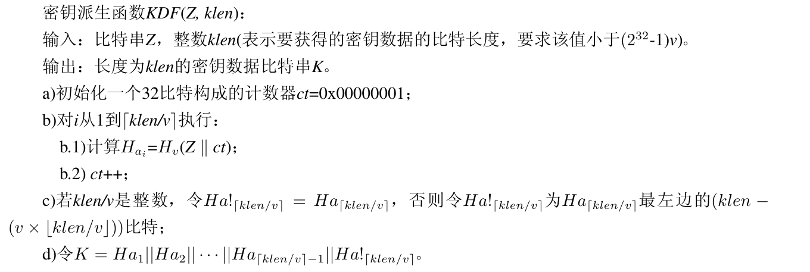
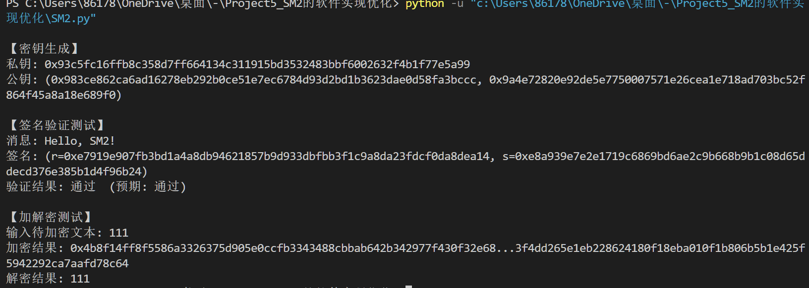

## Project 5: a).SM2 算法的Python软件实现与优化
#### 项目分工
| 姓名 | 分工                     |
|-------|--------------------------|
|  崔倡通  | sm2 python代码实现及相关报告编写 |
|  童皓琛   | sm2 改进尝试及相关报告编写       |

### 项目简介
本项目通过 Python 实现国密标准 SM2 椭圆曲线公钥密码算法，并对其核心运算（如点乘、模逆等）进行性能优化。

### 项目内容
#### 1. SM2椭圆曲线公钥密码算法原理概述
##### (1).算法参数与辅助函数

###### ①SM2 椭圆曲线参数设置如下：
  $F_p-256$上的椭圆曲线方程为：$y^2=x^3+ax+b$，基点$G=(x_G,y_G)$，其阶记为$n$
- 素数p：FFFFFFFE FFFFFFFF FFFFFFFF FFFFFFFF FFFFFFFF 00000000 FFFFFFFF FFFFFFFF
- 系数a：FFFFFFFE FFFFFFFF FFFFFFFF FFFFFFFF FFFFFFFF 00000000 FFFFFFFF FFFFFFFC
- 系数b：28E9FA9E 9D9F5E34 4D5A9E4B CF6509A7 F39789F5 15AB8F92 DDBCBD41 4D940E93
- 坐标xG：32C4AE2C 1F198119 5F990446 6A39C994 8FE30BBF F2660BE1 715A4589 334C74C7
- 坐标yG：BC3736A2 F4F6779C 59BDCEE3 6B692153 D0A9877C C62A4740 02DF32E5 2139F0A0
- 阶n：FFFFFFFE FFFFFFFF FFFFFFFF FFFFFFFF 7203DF6B 21C6052B 53BBF409 39D54123

###### ➁辅助函数
sm2算法涉及到三类辅助函数：密码杂凑函数、密钥派生函数和随机数发生器。
- **密码杂凑函数** 本部分使用SM3密码杂凑算法。
- **密钥派生函数** 密钥派生函数的作用是从共享的秘密比特串中派生出密钥数据,需要调用密码杂凑函数。具体定义如下：

- **随机数发生器** 使用` PyCryptodome ` 库中的随机数发生器。

##### (2).加密算法及流程
设需要发送的消息为比特串$M$，$klen$为$M$的比特长度。为了对明文$M$进行加密，作为加密者的用户$A$应实现以下运算步骤：
1. 用随机数发生器产生随机数$k\in [1,n-1]$；
2. 计算椭圆曲线点$C_1=[k]G=(x_1,y_1)$，将$C_1$的数据类型转换为比特串；
3. 计算椭圆曲线点$S=[h]P_B$，若$S$是无穷远点，则报错并退出；
4. 计算椭圆曲线点$[k]P_B=(x_2,y_2)$，将坐标$x_2、y_2 $的数据类型转换为比特串;
5. 计算$t=KDF(x_2||y_2,klen)$，若$t$为全0比特串，则返回1. ；
6. 计算$C_2 =M \oplus t$；
7. 计算$C_3 =Hash(x_2||M||y_2)$；
8. 输出密文$C =C_1||C_2||C_3$。
##### (3).解密算法及流程
设$klen$为密文$C_2$的比特长度。为了对密文$C =C_1||C_2||C_3$进行解密，作为解密者的用户B应实现以下运算步骤：
1. 从$C$中取出比特串$C_1$，将$C_1$的数据类型转换为椭圆曲线上的点，验证$C_1$是否满足椭圆曲线方程，若不满足则报错并退出；
2. 计算椭圆曲线点$S=[h]C_1$，若$S$是无穷远点，则报错并退出；
3. 计算$[d_B]C_1=(x_2,y_2)$，将坐标$x_2、y_2 $的数据类型转换为比特串;
4. 计算$t=KDF(x_2||y_2,klen)$，若$t$为全0比特串，则报错并退出 ；
5. 从$C$中取出比特串$C_2$，计算$M'  =C_2\oplus t$；
6. 计算$u =Hash(x_2||M'||y_2)$,从$C$中取出比特串$C_3$，若$u\neq C_3$，则报错并退出 ；
7. 输出明文$M'$。

##### (3).数字签名的生成算法及流程
设待签名的消息为 \( M \)，为了获取消息 \( M \) 的数字签名 \( (r,s) \)，作为签名者的用户A应实现以下运算步骤：

1. 置 \( M=Z_A \parallel M \)；  
2. 计算 \( e = H_v(M) \)，将 \( e \) 的数据类型转换为整数；  
3. 用随机数发生器产生随机数 \( k \in [1,n-1] \)；  
4. 计算椭圆曲线点 \( (x_1,y_1)=[k]G \)，将 \( x_1 \) 的数据类型转换为整数；  
5. 计算 \( r=(e+x_1) \mod n \)，若 \( r=0 \) 或 \( r+k=n \) 则返3；  
6. 计算 \( s = ((1+d_A)^{-1} \cdot (k-r\cdot d_A)) \mod n \)，若 \( s=0 \) 则返回3；  
7. 将 \( r, s \) 的数据类型转换为字符串，消息 \( M \) 的签名为 \( (r,s) \)。  
##### (4).数字签名的验证算法及流程
为了检验收到的消息 \( M' \) 及其数字签名 \((r', s')\)，作为验证者的用户B应实现以下运算步骤：
1. 检验 \( r' \in [1, n-1] \) 是否成立，若不成立则验证不通过；  
2. 检验 \( s' \in [1, n-1] \) 是否成立，若不成立则验证不通过；  
3. 置 \( M = Z_A \parallel M' \)；  
4. 计算 \( e' = H_v (M') \)，将 \( e' \) 的数据类型转换为整数；  
5. 将 \( r', s' \) 的数据类型转换为整数，计算 \( t = (r' + s') \, \text{mod} n \)，若 \( t = 0 \)，则验证不通过；  
6. 计算椭圆曲线点 \((x_1', y_1') = [s'] G + [t] P_A \)；  
7. 将 \( x_1' \) 的数据类型转换为整数，计算 \( R = (e' + x_1') \, \text{mod} n \)，检验 \( R = r' \) 是否成立，若成立则验证通过；否则验证不通过
#### 2. SM2椭圆曲线签名算法Python实现
##### (1).数字签名的生成算法实现
```python
def sm2_sign(M: bytes, user_id, d_A: int, xb: int, yb: int):
    """ SM2签名算法 """
    #拼接消息 M = ZA || M
    ZA = compute_user_hash(user_id, xb, yb)
    M_prime = ZA.encode('utf-8') + M
    e_bytes = sm3.sm3_hash(list(M_prime))
    e = int(e_bytes, 16)   
    k = getRandomRange(1, n - 1)  # 生成随机数 k ∈ [1, n-1]
    x1, y1 = ec_multiply_point(k, Gx, Gy) # 计算椭圆曲线点 (x1, y1) = [k]G
    r = (e + x1) % n            # 计算 r = (e + x1) mod n 
    # 计算 s = ((1 + d_A)⁻¹ · (k - r·d_A)) mod n
    s_value = inverse(1 + d_A, n)
    s = s_value* (k - r * d_A) % n 
    return (r, s)
```
##### (2).数字签名的生成算法实现
```python
def sm2_verify_signature(M_prime: bytes, user_id, signature,  xb: int, yb: int) :
    """ SM2签名验证算法 """
    r_, s_ = signature
    # 检验 r' ∈ [1, n-1], s' ∈ [1, n-1]
    if not (0 < r_ < n and 0 < s_ < n):
        return False    
    # M = ZA || M' 
    ZA = compute_user_hash(user_id, xb, yb)   
    M_ = ZA.encode('utf-8') + M_prime
    #计算 e' = H_v(M) 并转换为整数
    e_bytes = sm3.sm3_hash(list(M_))
    e_ = int(e_bytes, 16)   
    # 计算 t = (r' + s') mod n
    t = (r_+ s_) % n
    # 计算椭圆曲线点 (x1', y1') = [s']G + [t]P_A
    s_Gx, s_Gy = ec_multiply_point(s_ % n, Gx, Gy)
    # 计算 [t]P_A
    tPAx, tPAy = ec_multiply_point(t % n, xb, yb)
    # 点相加: [s']G + [t]P_A
    x1_prime, y1_prime = ec_add_point(s_Gx, s_Gy, tPAx, tPAy)
    #计算 R = (e' + x1') mod n
    R = (e_ + x1_prime) % n
    # 检验 R = r' 是否成立 
    return R == r_
```
#### 3. SM2椭圆曲线加解密算法Python实现
- 椭圆曲线点加法函数:在有限域GF(p)下运算，返回新点坐标(x3,y3)
```python
def ec_add_point(x1, y1, x2, y2): 
    """椭圆曲线点加法函数 对域元素进行运算"""
    if x1 != x2:
        lamda = ((y2 - y1) * inverse((x2 - x1), p)) % p  
        x3 = ((lamda ** 2) % p - x1 - x2) % p
        y3 = ((lamda * (x1 - x3)) % p - y1) % p
    else:
        lamda = ((3 * (x1 ** 2) % p + a) * inverse(2 * y1, p)) % p
        x3 = ((lamda ** 2) % p - 2 * x1) % p
        y3 = (lamda * (x1 - x3) % p - y1) % p
    return x3, y3
```
- 椭圆曲线$k$倍点函数:通过递归分解将乘法转化为加法
```python
def ec_multiply_point(k, x1, y1): 
    """椭圆曲线倍点运算函数 递归转化为加法运算"""
    if k == 1:
        return x1, y1
    elif k == 2:
        return ec_add_point(x1, y1, x1, y1)
    elif k % 2 == 0:
        x, y = ec_multiply_point(k // 2, x1, y1)
        x, y = ec_multiply_point(2, x, y)
        return x, y
    elif k % 2 == 1:
        x, y = ec_multiply_point((k - 1) // 2, x1, y1)
        x, y = ec_multiply_point(2, x, y)
        x, y = ec_add_point(x, y, x1, y1)
        return x, y
```
- 密钥派生函数:从共享的秘密比特串中派生出密钥数据
```python
def KDF(Z: str, klen: int):
    """密钥派生函数"""
    v = 256          # SM3 输出长度
    v_bytes = 32 
    ct = 0x00000001  # 计数器
    H = []           # 哈希值列表
    K = ''           # 最终密钥比特串
    klen_bytes= ceil_div(klen, 8)
    interation = ceil_div(klen_bytes, v_bytes)
    for _ in range(interation):
        # 将输入数据转为字节列表
        data = Z + bin(ct)[2:].zfill(32)
        byte_list = list(data.encode('utf-8'))
        # 调用 gmssl 的 SM3
        m = sm3.sm3_hash(byte_list)
        # 将哈希结果（十六进制字符串）转为二进制并补齐256位
        H.append(bin(int(m, 16))[2:].zfill(v))
        ct += 1
    # 每块密钥进行拼接，最后一块如果不足256位，用左边比特补齐
    if klen % v == 0:
        for i in range(0, interation):
            K += H[i]
    else:
        for i in range(0, interation - 1):
            K += H[i]
        K += H[interation - 1][:klen % v]
    # 验证密钥生成长度满足预期后再return
    if len(K) == klen:
        return int(K, 2)
    else:
        print("KDF error!")
```
##### (1).SM2椭圆曲线加密函数
```python
def sm2_encrypt(M: bytes, xb, yb):
    if (xb, yb) == (0, 0):
        raise ValueError("公钥无效 (无穷远点)")
    M = int(M.hex(), 16)
    k = getRandomRange(1, n)                    #随机数发生器产生随机数k
    #计算椭圆曲线点C1
    C1_x, C1_y = ec_multiply_point(k, Gx, Gy)   
    PC = '0x04' 
    C1 = int(PC[2:] + hex(C1_x)[2:] + hex(C1_y)[2:], 16)  #将C1的数据类型转换为比特串
    x2, y2 = ec_multiply_point(k, xb, yb)
    x2_y2 = bin(x2)[2:] + bin(y2)[2:]
    t = KDF(x2_y2, size(int(x2_y2,2)))
    #计算C2 =M⊕t
    C2 = M ^ t       
    # 计算哈希 C3 = SM3(x2 || m || y2)
    data = bin(x2)[2:] + bin(M)[2:] + bin(y2)[2:]
    byte_list = list(data.encode('utf-8'))
    C3 = int(sm3.sm3_hash(byte_list), 16)
    C = hex(C1)[2:] + hex(C2)[2:] + hex(C3)[2:]
    return C1_x, C1_y, C2, C3, C
```
##### (2).SM2椭圆曲线解密函数
代码逻辑与加密相反，具体见代码文件。

- 函数测试示例结果



#### 4. SM2密码算法改进尝试
##### (1).实现 SM2 曲线参数特化的快速模约减、模逆元算法。 
SM2曲线推荐参数中，素数$p$为广义梅森素数$p=2^{256}-2^{224}-2^{96}+2^{64}-1$,利用广义梅森素数的性质，可以实现针对 psm2p256 特化的快速模约减、模逆元算法，从而提高模约减和模逆元的速度。
-  快速模约减算法, 利用 p 的特殊形式，我们可以实现高效的模约减：
```python
def fast_reduce(x):
    """
    利用广义梅森素数性质实现的快速模约减
    输入：x (0 <= x < p²)
    输出：x mod p
    """
    # 将 x 分解为 256 位块
    x_low = x & ((1 << 256) - 1)  # 低 256 位
    x_high = x >> 256             # 高 256 位
    # 利用恒等式：2²⁵⁶ ≡ 2²²⁴ + 2⁹⁶ - 2⁶⁴ + 1 (mod p)
    term1 = x_high << 224  # x_high * 2²²⁴
    term2 = x_high << 96   # x_high * 2⁹⁶
    term3 = x_high << 64   # x_high * 2⁶⁴ (用于减法)
    term4 = x_high         # x_high * 1
    # 组合结果：x = x_low + term1 + term2 - term3 + term4
    result = x_low + term1 + term2 + term4 - term3
    # 模约减（最多需要两次减法）
    while result >= SM2.p:
        result -= SM2.p
    while result < 0:
        result += SM2.p
    return result
```
-  快速模逆元算法,利用费马小定理和 p 的特殊形式：
```python
def fast_inverse(a):
    """
    利用费马小定理和快速模幂实现的模逆元
    输入：a (0 < a < p)
    输出：a⁻¹ mod p
    """
    # 计算指数：exp = p - 2
    a2 = fast_multiply(a, a)    # 计算 a²
    a4 = fast_multiply(a2, a2)  # 计算 a⁴ = (a²)²
    a8 = fast_multiply(a4, a4)   # 计算 a⁸ = (a⁴)²
    a16 = fast_multiply(a8, a8)    # 计算 a¹⁶ = (a⁸)²
    t = a16    # 继续平方直到 a²⁵⁶
    for _ in range(4):  # 16 -> 32 -> 64 -> 128 -> 256
        t = fast_multiply(t, t)
    a224 = t        # 计算 a²²⁴ = a²⁵⁶ / a³²
    for _ in range(32):
        a224 = fast_multiply(a224, a)
    a96 = a16    # 计算 a⁹⁶
    for _ in range(4):  # 16 -> 32 -> 64 -> 96 (需要额外乘以 a³²)
        a96 = fast_multiply(a96, a96)
    a32 = a16
    for _ in range(16):  # 16 -> 32
        a32 = fast_multiply(a32, a32)
    a96 = fast_multiply(a96, a32)
    
    # 组合结果：a^{p-2} = a²⁵⁶ / (a²²⁴ * a⁹⁶) * a⁻³
    denominator = fast_multiply(a224, a96)
    inverse_denom = fast_inverse(denominator)  # 递归计算小指数逆元
    result = fast_multiply(t, inverse_denom)
    result = fast_multiply(result, fast_inverse(fast_multiply(a, a2)))
    return result
```
-  优化后的点加运算函数
```python
def ec_add_point(x1, y1, x2, y2):
    """优化后的椭圆曲线点加法函数"""
    # SM2 曲线参数
    a = 0xFFFFFFFEFFFFFFFFFFFFFFFFFFFFFFFFFFFFFFFF00000000FFFFFFFFFFFFFFFC
    if x1 != x2:
        # 计算 λ = (y2 - y1)/(x2 - x1)
        dy = fast_reduce(y2 - y1)  # 优化模减法
        dx = fast_reduce(x2 - x1)
        inv_dx = fast_inverse(dx)
        lamda = fast_reduce(dy * inv_dx)
    else:
        # 倍点运算：λ = (3x₁² + a)/(2y₁)
        x1_sq = fast_reduce(x1 * x1)
        three_x1_sq = fast_reduce(3 * x1_sq)
        numerator = fast_reduce(three_x1_sq + a)
        denominator = fast_reduce(2 * y1)
        inv_denom = fast_inverse(denominator)
        lamda = fast_reduce(numerator * inv_denom)
    # 计算 x3 = λ² - x1 - x2
    lamda_sq = fast_reduce(lamda * lamda)
    x3 = fast_reduce(lamda_sq - x1 - x2)
    # 计算 y3 = λ(x1 - x3) - y1
    dx1x3 = fast_reduce(x1 - x3)
    lamda_dx = fast_reduce(lamda * dx1x3)
    y3 = fast_reduce(lamda_dx - y1)
    return x3, y3
```

##### (2).采用预计算优化椭圆曲线多倍点运算。
由于椭圆曲线点 $G$是固定不变的，因此我们可以扩大预计算的规模，并将预计算结果以预计算表的形式写入到源代码中，在运算时查表即可获得预计算值，以获得更好的性能提升效果。具体代码如下：
```python
def precompute_fixed_base(base_x, base_y, max_k_bits=256):
    """预计算固定基点的所有2^i倍点"""
    # 初始化表，存储[P, 2P, 4P, 8P,...]
    table = [(base_x, base_y)]  # 第一个元素是2^0*P = P
    
    # 循环计算2^i倍点
    for _ in range(1, max_k_bits):
        last = table[-1]  # 获取表中最新的点
        # 计算当前点的倍点：2^(i)P = 2 * 2^(i-1)P
        next_point = SM2.ec_add_point(last[0], last[1], last[0], last[1])
        table.append(next_point)
    return table

def ec_multiply_fixed_base(k, precomputed_table):
    """使用预计算表进行多倍点运算"""
    result = None  # 初始化结果为无穷远点
    # 遍历预计算表中的每个点
    for i, point in enumerate(precomputed_table):
        # 检查k的第i位是否为1
        if (k >> i) & 1:
            if result is None:
                # 首次遇到1的位，直接赋值
                result = point
            else:
                # 将当前点加到结果中
                result = SM2.ec_add_point(result[0], result[1], point[0], point[1])
    return result
```
#### 5. 测试样例
