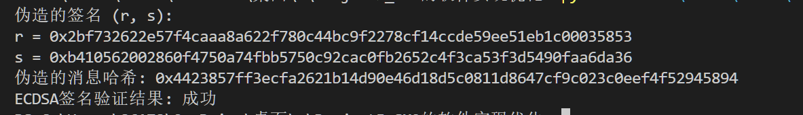

## Project 5: C).伪造中本聪的数字签名
#### 项目分工
| 姓名 | 分工                     |
|-------|--------------------------|
|  童皓琛   |   报告原理编写          |
|  崔倡通  | 代码编写测试 |
### 项目简介
本项目基于正常ECDSA签名算法尝试实现伪造中本聪的数字签名：


### 项目内容
#### 1. ECDSA签名算法原理
##### (1).算法参数
###### 本项目采用比特币中使用的椭圆曲线参数secp256k1 ，具体设置如下：
椭圆曲线方程为：$y^2=x^3+ax+b$，基点$G=(x_G,y_G)$，其阶记为$n$
- 素数p： FFFFFFFF FFFFFFFF FFFFFFFF FFFFFFFF FFFFFFFF FFFFFFFF FFFFFFFE FFFFFC2F
- 系数a：00000000 00000000 00000000 00000000 00000000 00000000 00000000 00000000
- 系数b：00000000 00000000 00000000 00000000 00000000 00000000 00000000 00000007
- 坐标xG：79BE667E F9DCBBAC 55A06295 CE870B07 029BFCDB 2DCE28D9 59F2815B 16F81798
- 坐标yG：483ADA77 26A3C465 5DA4FBFC 0E1108A8 FD17B448 A6855419 9C47D08F FB10D4B8
- 阶n：FFFFFFFF FFFFFFFF FFFFFFFF FFFFFFFE BAAEDCE6 AF48A03B BFD25E8C D0364141
##### (1). 密钥生成算法
随机选取整数$d$作为私钥，计算$P=dG$作为公钥 
##### (2).签名算法
- \(k \leftarrow Z_n^*,R=kG \)
- $r=R_x \mod n,r\neq 0$
- $e=hash(m)$
- $ s = k^{-1}(e+dr) \mod n$
- 输出签名$(r,s)$

##### (3).验证算法
通过公钥$P$验证签名$(r,s)$:
- $e=hash(m)$
- $w = s^{-1} \mod n$
- $ (r',s') = e\cdot wG+r\cdot wP  \mod n$
- 若$r'=r$则验证成功，否则验证失败。

#### 2. 伪造签名算法原理
设待签名的消息为$e$，对$e$进行直接签名，可以按照如下过程构造出一组$(r',s')$和$e'$，使得其可以通过验证算法的验证：
首先假定$(r',s')$存在，令$a = s'^{-1}e' \mod n,b = s'^{-1}r' \mod n$，进而有
\[w'(e'\cdot G+r'\cdot P)=a\cdot G+b\cdot P
\]
根据以上关系式可以在合适范围内随机选取数$a$和$b$，令
- $r'=(a\cdot G+b\cdot P)_x$
- $s'= b^{-1}r' \mod n$
- $e'= as' \mod n$
综上通过公共参数和密钥推导出一组可以通过验证的有效签名$(r',s')$和对应消息哈希$e'$

#### 3. 伪造签名算法代码实现
```python
def ECDSA_sign(m: str,d: int):
    """
    ECDSA 签名算法
    :param d: 私钥 (整数)
    :param m: 待签名的消息 (字符串)
    :return: 签名 (r, s)
    """
    e_bytes = hashlib.sha256(m.encode()).digest()   # 计算消息的哈希 e = hash(m)
    e = bytes_to_long(e_bytes)
    k = getRandomRange(1, n-1)  # 随机选取 k ∈ [1, n-1]
    R = k * G                   # 计算 R = kG
    r = R.x % n                 # 计算 r = R.x mod n
    k_inv = inverse(k, n)       # 计算 s = k⁻¹ (e + dr) mod n
    s = (k_inv * (e + d * r)) % n  
    signature = (r, s)
    return signature

def ECDSA_verify_signature(e , P, signature):
    """
    验证ECDSA签名
    Args:
        e : 消息哈希
        P : 公钥
        signature(r,s):消息签名
    Returns:.
        bool : 验证结果
    """
    r, s = signature
    if not (1 <= r < n and 1 <= s < n):
        return False
    w = inverse(s, n)    #w=s^{−1} modn
    u1 = (e * w) % n
    u2 = (r * w) % n
    P_ = u1 * G + u2 * P
    return P_.x % n == r

def forge_Satoshi_Sign():
    """
    伪造中本聪的数字签名
    Returns:.
        signature(r,s):伪造消息签名
    """
    a = getRandomRange(1, n - 1) #随机选取a
    b = getRandomRange(1, n - 1) #随机选取b
    R_prime = a * G + b * satoshi_pubkey
    r_prime = R_prime.x % n
    b_inv = inverse(b, n)  
    s_prime = (r_prime * b_inv) % n

    e_prime = (a * s_prime) % n
    # 构造伪造的签名
    forged_signature = (r_prime, s_prime)
    forged_message_hash = e_prime
    return forged_signature, forged_message_hash
```
测试结果
